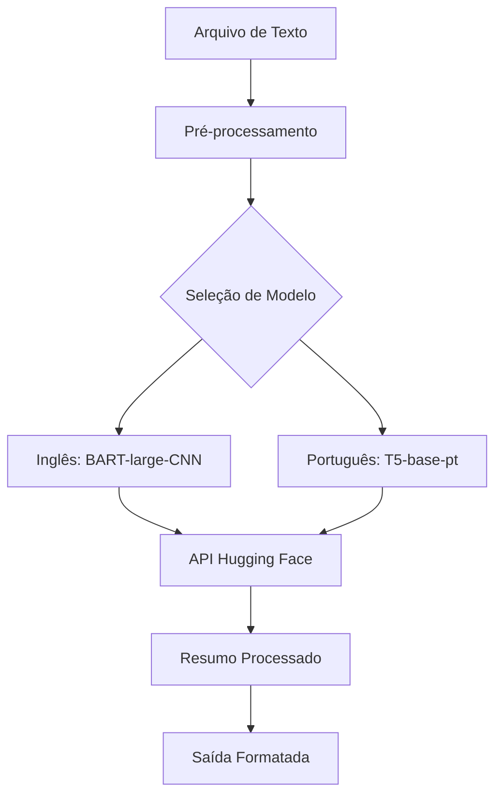

# Resumidor Automático de Textos com IA

## Visão Geral

Este projeto utiliza modelos avançados de Processamento de Linguagem Natural (NLP) para gerar resumos concisos de textos longos em português e inglês. Implementado em Python, o sistema se conecta à API do Hugging Face para acessar modelos state-of-the-art de sumarização textual.

### Modelos de IA
- **Para Inglês**: `facebook/bart-large-cnn`  
  Um modelo BART fine-tuned especificamente para sumarização de artigos no estilo CNN/Daily Mail, produzindo resumos fluidos e coerentes.

- **Para Português**: `pierreguillou/t5-base-pt-sum-text-summary`  
  Versão do modelo T5 especialmente treinada para textos em português, capaz de identificar os pontos-chave de documentos complexos.

### Infraestrutura Técnica
- **Linguagem**: Python 3.8+
- **Bibliotecas Principais**:
  - `requests`: Para comunicação HTTP com a API do Hugging Face
  - `python-dotenv`: Para gerenciamento seguro de credenciais (opcional)

- **Plataforma**: Hugging Face Inference API  
  Serviço que hospeda os modelos e fornece endpoints para inferência em nuvem.

## Como Funciona

1. **Pré-processamento**:
   - O texto de entrada é limpo e preparado para processamento
   - O sistema detecta automaticamente o idioma baseado no modelo selecionado

2. **Sumarização**:
   - O texto é enviado para o modelo apropriado na Hugging Face API
   - O modelo utiliza técnicas de atenção para identificar as partes mais relevantes
   - Gera um novo texto que preserva a informação essencial em menos palavras

3. **Pós-processamento**:
   - O resumo é formatado para melhor legibilidade
   - Informações meta sobre o processo são agregadas à saída

# Casos de Uso

- Resumo automático de notícias e artigos
- Pré-processamento de documentos para análise
- Criação de abstracts para pesquisas acadêmicas
- Ferramenta de produtividade para leitura rápida

##  Arquitetura

## Próximos Passos

- Adicionar suporte a mais idiomas
- Implementar cache de resultados
- Criar interface web
- Adicionar controle de qualidade dos resumos

Este projeto demonstra o poder da NLP moderna aplicada a uma necessidade cotidiana - a capacidade de condensar informação sem perder o significado essencial.
